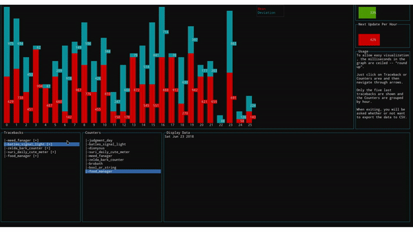

# raccoon

<div align = "center">
    <br>
    
    <br>
    <br>

[](https://saythanks.io/to/Fazendaaa)

[](./README.md)
[](./docs/readme/README_PT.md)

[](https://travis-ci.com/Fazendaaa/raccoon)
[](https://www.codacy.com?utm_source=github.com&amp;utm_medium=referral&amp;utm_content=Fazendaaa/raccoon&amp;utm_campaign=Badge_Grade)

</div>

## About
Job application to two categories are described as follows:
* [Dev](./README.md#Dev)
* [Tags](./README.md#Tags)

All of this work was made in a Linux environment only, using it in Mac or Windows might need some different steps; read carefully the steps about installing and configuring the applications. 

# Dev
A Command Line Interface (CLI) application to show info about some projects. This info is processed through data consumed from an Representational State Transfer Application Programming Interface (REST API) that only accepts __GET__ method and it's response is a JSON, unicode, format; this response is an array of logs. This application needs to perform sorting and analysis of those logs, presenting the following:
* Last five tracebacks of all projects;
* Mean and the standard deviation from the requests;
* Error and critical counter, grouped by hour and project.

The API presents the following rules:
* 30 requisitions for minute;
* 1200 logs each requisition or the difference between then.

The application must update the data each minute, assuming the already consumed data. As discussed with the recruiter, I've decided the running time from the app as the starting point for the requests.

## Data
_Host_ and _authorization_ are being inserted in the request header through a __.env__ file as the following format:

```bash
HOSTNAME="endpoint-here"
AUTHORIZATION="api-key-here"
```

Since the idea behind this project isn't to have access to this information but how they are utilized though out this application.

The requests are being handle through the following https request:

```https
hostname: "endpoint-here"
authorization: "api-key-here"
```

The API response will be like that:

```typescript
{
    timestamp: number;
    level: INFO | DEBUG | ERROR | CRITICAL (string);
    project: string;
    message: string;
    response_code: number;
    traceback: string (optional);
    request_duration: number (optional); 
}
```

As the API are being consumed through a Node application -- and the all JavaScript (JS) numbers are _floats_ -- I've modified the response style presented here because, to the process, won't matter whether or not the numbers are __float__ or __int__.

## CLI

<div align="center">
    
</div>

# Tags
A series of JS questions. I've implemented some of them in TS so they could be my proof of concept located at [tags](./src/tags/) folder.

All of the answered questions can be found at [tags.md](./tags.md) file.

The questions are the things that the job description asked, even so I've decided to implement it in Node to allow me testing it as automatically possible; that way I won't be attached to always needing to open my browser to see whether or not it works.

Since the idea is to provide the answers to the questions only, I won't be attaching the website used as dependency, and is configured in the __.env__ file as:

```bash
URL="website-url-here"
```

# Installing
The projects are written in [Node](https://nodejs.org/) and the help of [npm](https://www.npmjs.com/) to work. Once they are installed, just open the project directory and run the following command to install the dependencies:

```bash
npm install
```

# How to use it

To run the projects, before all of that, compile the files. Since they are written in TypeScript (TS) and Node runs JS to do so, run the following command:

```bash
npm run build
```

## Dev
To run the Dev project, just:

```bash
npm run dev
```

## Tags
To run the Tags project, just:

```bash
npm run tags
```

# Built with
* [blessed](https://github.com/chjj/blessed)
* [blessed-contrib](https://github.com/yaronn/blessed-contrib)
* [Dotenv](https://github.com/motdotla/dotenv)
* [jsdom](https://github.com/jsdom/jsdom)
* [json2csv](https://github.com/zemirco/json2csv)
* [TypeScript](http://typescriptlang.org/)

## Code
Plain and simple [Typescript](http://typescriptlang.org/) with the [Microsoft](https://github.com/Microsoft/tslint-microsoft-contrib) linter standards as base.

Some functions have side-effects, they are tagged with **__** at the end and those whom are callbacks have it at the beginning.

## Testing
Tests are written with [Jest](https://facebook.github.io/jest/) through [ts-jest](https://www.npmjs.com/package/ts-jest) and integrated with [Travis CI](http://travis-ci.org/). To run all tests just:

```bash
npm test
```

When running the tests, there's no need of previously building it; the TS files only are needed.

# Contributing
Just talk to me through an _issue_.

# Versioning
There's no versioning system being used here due to the ephemeral nature of this project. 

# TODO
If projects updates should be needed I will do it here; or any case of a following stage in this application -- which will change the versioning system.

# Authors
* Just [me](https://github.com/Fazendaaa).

# License
Like many Open-Source Software (OSS) the MIT license is used, more about it in  [LICENSE](https://github.com/Fazendaaa/raccoon/blob/master/LICENSE).
