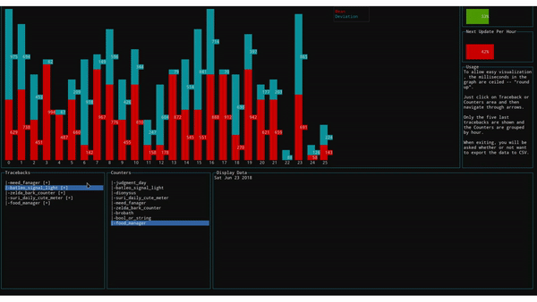

# raccoon

<div align = "center">
    <br>
    
    <br>
    <br>

[](https://saythanks.io/to/Fazendaaa)

[](../../README.md)
[](./README_PT.md)

[](https://travis-ci.com/Fazendaaa/raccoon)
[](https://codecov.io/gh/Fazendaaa/raccoon)
[](https://www.codacy.com?utm_source=github.com&amp;utm_medium=referral&amp;utm_content=Fazendaaa/raccoon&amp;utm_campaign=Badge_Grade)
[](https://codeclimate.com/github/Fazendaaa/raccoon/master/package.json)
[](https://snyk.io/test/github/Fazendaaa/raccoon)

</div>

## Sobre
Software desenvolvido para um processo seletivo das duas seguintes vagas:
* [Dev](#Dev)
* [Tags](#Tags)

Todo esses trabalhos foram feitos em Linux apenas, então utilizar eles no Mac ou Windows pode requerer passos diferentes; leia com cuidado os passos de instalção e configuração dos programas.

# Dev
Um programa de Interface de Linha de Comando (CLI) para mostrar infromações consumidos de alguns projetos. Essas informações são consumidas através de dados provenientes de uma Interface de Programação de Transferência de Dados de Transferência de Estados Representativos (REST API) que aceita apenas __GET__ e responde, no formato JSON -- unicode --, logs de softwares para que, desta maneira, desempenhe organização e agregação desses logs apresentando as seguintes informações:
* Média e desvio padrão do tempo das requisições;
* Últimos cinco tracebacks dentre todos os projetos;
* Contador de erros e mensagens críticas, agrupados por projeto e hora.

O consumo da API possui as seguintes características:
* Máximo de 30 requisições por minuto;
* 1200 logs a cada requisição ou os que não foram consumidos entre as requisições.

Atualizar os dados a cada minuto, levando em conta os já consumidos. Como discutido com o recrutador, decidi optar por utilizar o tempo de inicialização da aplicação como o contador de tempo das requisições.

## Dados
O _host_ e a _authorization_ a serem inseridos no header da requisão encontram-se em um arquivo __.env__, que deve estar localizado no diretório raiz do projeto no formato:

```bash
HOSTNAME="endpoint-da-api-aqui"
AUTHORIZATION="chave-da-api-aqui"
```

Uma vez que a ideia não é ter o acesso a essas informações mas sim mostrar como foi desenvolvido o projeto.

Os requests serão feitos da seguinte maneira em um cabeçalho https:

```https
hostname: "endpoint-da-api-aqui"
authorization: "chave-da-api-aqui"
```

Já a resposta será um array do tipo:

```typescript
{
    timestamp: number;
    level: INFO | DEBUG | ERROR | CRITICAL (string);
    project: string;
    message: string;
    response_code: number;
    traceback: string (opcional);
    request_duration: number (opcional); 
}
```

Como a API será consumida por uma aplicação Node -- e os números são todos _floats_ por causa do JavaScript (JS) em si -- modifiquei o estilo da resposta a ser apresentada aqui porque, para a aplicação, não vai importar se o número será __float__ ou __int__.

## CLI

<div align="center">
    
</div>

# Tags
Questões sobre JS. Eu implementei algumas dela em TypeScript (TS) para qe pudessem servir como uma prova de conceito e estão na pasta [tags](../../src/tags/). Todas as questões respondidas, que foi o pedido para este projeto, podem ser encontradas no arquivo [tags_pt.md](../tags/tags_pt.md).

As respostas se atém ao que foi pedido na descrição do manual do candidato. Mesmo assim decidi implementar em Node mesmo para facilitar testes e não depender apenas de trabalho manual de ficar verificando no navegador sempre o comportamento quando eles podem ser simulados com o auxílio de algumas ferramentas.

Como o foco do projeto é em si mostrar como manipular os arquivos por isso não foram fornecidos, o link está do site utilizado está configurado no arquivo __.env__ como:

```bash
URL="url-do-site-aqui"
```

# Instalação
Os projetos dependem de [Node](https://nodejs.org/) e do [npm](https://www.npmjs.com/) para funcionar, então basta instalar eles e rodar em seguida no diretório contendo os arquivos o seguinte comando no terminal:

```bash
npm install
```

# Como utilizar

Para rodar os programas, antes de tudo, compile os arquivos, uma vez que foram feitos com TS e devem rodar JS; para tal, abrar seu terminal no diretório raíz deste projeto e digite:

```bash
npm run build
```

## Dev
Caso queira rodar o projeto de Dev basta rodar:

```bash
npm run dev
```

## Tags
Caso queira rodar o projeto de Tags basta rodar:

```bash
npm run tags
```

### Versão "enfeiurada"
Para desenvolver a versão enfeiruda do código, rode:

```bash
npm run uglify
```

# Construído com
* [blessed](https://github.com/chjj/blessed)
* [blessed-contrib](https://github.com/yaronn/blessed-contrib)
* [Dotenv](https://github.com/motdotla/dotenv)
* [jsdom](https://github.com/jsdom/jsdom)
* [json2csv](https://github.com/zemirco/json2csv)
* [uglify-js-es6](https://github.com/paulovieira/UglifyJS2)

## Código
Simples [TS](http://typescriptlang.org/) com o padrão de escrita [Microsoft](https://github.com/Microsoft/tslint-microsoft-contrib) como base. Como há a utilização do TS em si em ambos os projetos, o arquivo _.tsconfig.json_ foi configurado para aceitar apenas o formato [ECMA Script 6](http://es6-features.org).

Adicionei também uma revisão de código através do [Codacy](http://codacy.com/).

Algumas funções possuem _side-effects_, elas possuem **__** no final do nome e aquelas que são callbacks no começo.

## Testes
Testes foram escritos com [Jest](https://facebook.github.io/jest/) atavés do pacote [ts-jest](https://www.npmjs.com/package/ts-jest) e há uma integração com [Travis CI](http://travis-ci.org/) e [Codecov](https://codecov.io/). Para rodar todos os testes basta rodar:

```bash
npm test
```

Para rodar os testes não precisa "buildar" antes os arquivos de TS para JS, apenas os TS serão necessários.

Para ajudar os testes da API, foi utilizado o site [mockapi](https://www.mockapi.io/). Além disso, [alcula](http://www.alcula.com/calculators/statistics/standard-deviation/) me ajudou a calcular o __desvio padrão__ e a __média__ para os dados de testes.

# Contribuindo
Converse comigo através de uma _issue_ sobre isso e analizarei o pedido.

# Versionamento
Não há nenhum sistema de versionamento a ser utilizado devido a natureza efêmera do projeto e devido a não utilização de bibliotecas com uma alta taxa de atualizações. 

# Segurança
Eu adicinei uma integração com [Synk](https://snyk.io/) para garantir que todas as dependências utilizadas não tenham erros ou bugs não concertados antes da Integração Contínua (CI).

# A fazer
Caso saiba de atualizações ao processo, as farei aqui mesmo; ou em caso de uma segunda fase que utilize esta -- o que alteraria o sistema de versionamento.

# Autores
* Apenas [eu](https://github.com/Fazendaaa).

# Licença
Como muitos projetos open source, a licença MIT é utilizada, mais sobre isso em [LICENSE](https://github.com/Fazendaaa/raccoon/blob/master/LICENSE).
